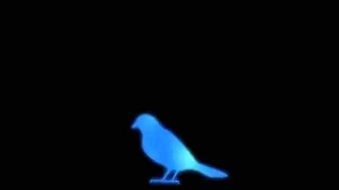
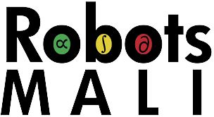
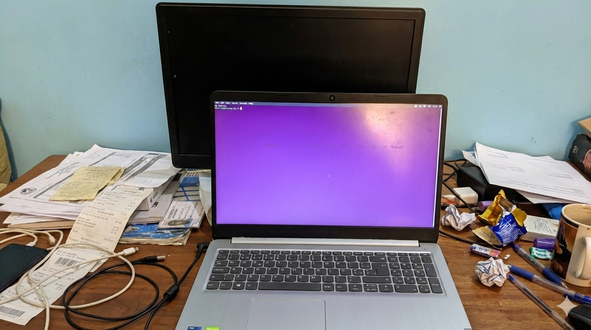

  

Hi, I'm Yacouba Diarra (**diarray** on the internet) and I care about stuffs like having a [blog](./blog.md) to post about, well... [stuffs](https://diarray-hub.github.io/misc/2026/01/13/stuff.html). By the way this website was created with [markdown](https://docs.github.com/en/pages/setting-up-a-github-pages-site-with-jekyll/creating-a-github-pages-site-with-jekyll), what a great framework to create a [motherfucking website](https://motherfuckingwebsite.com/)!

Right now? I'm doing research on speech recognition at RobotsMali [AI4D](https://idrc-crdi.ca/en/initiative/artificial-intelligence-development) Lab. If you want to know more about me check my ChatGPT biography @ [whoami](./whoami.md), I'll try to update it maybe once every leap year. Here are some of the stuffs I have worked on and places you can find them (I'll update this more often):

---

## Projects

  

  
2024 - 2026

  

  

    

      
    

    

      <b>Researcher</b> @ <a href="https://huggingface.co/RobotsMali">RobotsMali AI4D Lab.</a>
      <ul>
        <li><b>Datasets & Models:</b> Released <a href="https://huggingface.co/datasets/RobotsMali/afvoices">African Next Voices</a> (612h) and <a href="https://huggingface.co/datasets/RobotsMali/kunkado">Kunkado</a> (160h) open Bambara ASR datasets and associated <a href="https://huggingface.co/RobotsMali/models">models</a></li>
        <li><b>An be Kalan:</b> Initiated the RobotsMali literacy apps development (<a href="https://github.com/RobotsMali-AI/an-be-kalan">GitHub</a> / <a href="https://play.google.com/store/apps/details?id=org.robotsmali.literacy_app&hl=en">Store</a>) + edge deployment of our ASR models to enable offline usage in Mali.</li>
        <li><b>Fintech:</b> Lately, my focus shifted to exploring and adapting foundational ML techniques to drive financial inclusion in the absence of an established credit system.</li>
      </ul>
    

  

  
2022 - Present

  

  

    

      
    

    

      <b>Personal Projects</b>
      <ul>
        <li><b>Space:</b> I'm currently exploring Machine Learning in Observational Astronomical and space discovery.</li>
        <li><b>Robotics:</b> <a href="https://www.ros.org/">ROS</a> and Computer Vision; bronze medalist at the <a href="https://github.com/diarray-hub/PARC-Engineers-League">2023 Panafrican Robotics Competition</a>.</li>
        <li><b>Credit Scoring:</b> I developed fundamental skills during my <a href="https://github.com/diarray-hub/predicting-loans-defaults">undergrad project</a>, using <a href="https://ieeexplore.ieee.org/document/7344858">DFS</a> to create features from a <a href="https://www.kaggle.com/datasets/diarray/deep-feature-synthesis-home-credit-stability">large relational database</a> and compare ML algorithms for credit scoring.</li>
        <li><b>Learning:</b> At some point I was obsessed about <a href="https://github.com/diarray-hub/covid_classification">implementing DL techniques from scratch</a>; keep in mind this was started in the pre-ChatGPT era so it was all struggle and learnings. Special mention to Michael Nielsen for his <a href="http://neuralnetworksanddeeplearning.com/">book.</a></li>
      </ul>
    

  

---

## Publications

For a full list of my publications, check my [Semantic Scholar](https://www.semanticscholar.org/author/Yacouba-Diarra/2267627632) or [Google Scholar](https://scholar.google.com/citations?hl=en&user=OsbQk2MAAAAJ) profiles.

* **Listen, Attend, Understand: a Regularization Technique for Stable E2E Speech Translation Training on High Variance labels** (2026).
  *Yacouba Diarra and Michael Leventhal.* [arXiv](https://arxiv.org/abs/2601.01121)

* **Kunnafonidilaw ka Cadeau (Kunkado): an ASR dataset of present-day Bambara** (2025).
  *Yacouba Diarra, P. A. Kamaté, N. S. Coulibaly, and M. Leventhal.* [arXiv](https://arxiv.org/abs/2512.19400) | [HuggingFace](https://huggingface.co/datasets/RobotsMali/kunkado)

* **Dealing with the Hard Facts of Low-Resource African NLP** (2025).
  *Yacouba Diarra et al.* [arXiv](https://arxiv.org/abs/2511.18557) | [HuggingFace](https://huggingface.co/datasets/RobotsMali/afvoices)

* **Cost Analysis of Human-corrected Transcription for Predominately Oral Languages** (2025).
  *Yacouba Diarra, N. S. Coulibaly, and M. Leventhal.* [arXiv](https://arxiv.org/abs/2510.12781)
